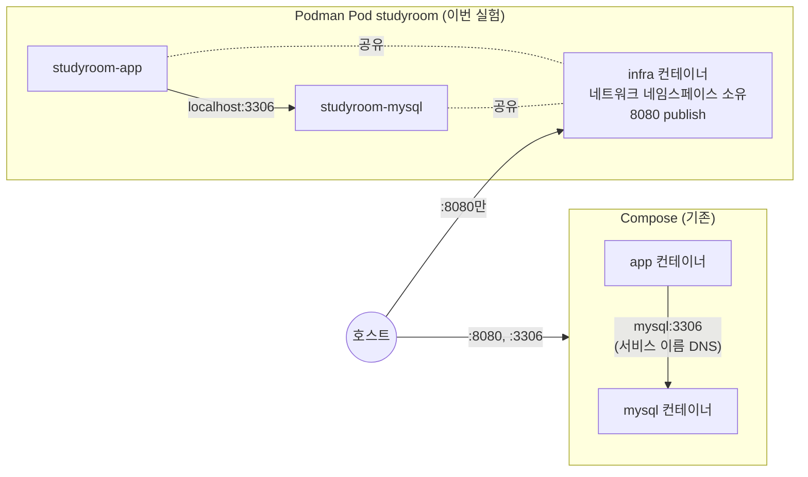

# Podman으로 옮겨 본 스터디룸 예약 API

[](https://github.com/enderpawar/podman-studyroom-lab/actions/workflows/ci.yml)

5주 동안 만든 스터디룸 예약 API(Spring Boot 3.5.3 · Java 17 · MySQL 8 · Flyway · JWT)를 **Docker 대신 Podman으로** 실행해 본 실험 저장소다.
처음에는 블로그 글에 "이렇게 하면 된다"는 설계안만 써 두었다. 그 설계안을 실제로 하나씩 실행해 보고, 어디가 맞고 어디가 틀렸는지 오류 원문과 측정값으로 남겼다.

- 원본 코드: [enderpawar/Developer-Roadmap_Spring_Study](https://github.com/enderpawar/Developer-Roadmap_Spring_Study) @ `15e0703` (Week E 완료 시점)
- 검증 환경: Windows 11 · WSL 2.7.13 · Podman 5.8.3(클라이언트) / 5.8.8(machine, rootless) · Temurin 17
- 전체 기록: [docs/verification.md](docs/verification.md) — 명령별 실제 출력, 블로그 초안과 다른 점 22건

## 1. 결과 한눈에 보기

| 단계 | 한 일 | 결과 | 측정값 |
|---|---|---|---|
| 1 | Dockerfile `FROM`을 정식 이름으로 바꾸고 `podman build` | ✅ | 빌드 64초, 이미지 380 MB |
| 2 | 기존 `compose.yaml`을 `podman compose`로 실행 | ✅ | mysql이 healthy가 된 뒤 app 시작(mysql 시작 18초 뒤), 재시작 0회 |
| 3 | Pod 하나에 mysql + app (`scripts/podman-pod-up.sh`) | ✅ | 29초, 호스트 3306 닫힘 · 8080만 열림 |
| 4 | 쿠버네티스 YAML로 `podman kube play` | ✅ | 새 볼륨: app 재시작 3회 후 20초 / 기존 볼륨: 9초 |
| 5 | non-root 이미지(`USER 1001:1001`) | ✅ 수정 1회 | `uid=1001(spring) gid=1001(spring)` |
| 6 | Quadlet으로 systemd 사용자 서비스화 | ✅ | `start` 0.9초, `/health` OK, stop 후 정리 |
| 7 | GitHub Actions `podman` 잡 | 아래 배지 / [3.7절](docs/verification.md#37-7단계--ci-podman-잡) | |
| 8 | Testcontainers로 실제 MySQL에서 Flyway 검증 | ✅ | 73개 테스트 통과, Day32 `1064` 오류 로컬 재현 |

## 2. 구조: Compose에서 Pod로



- 같은 Pod 안의 컨테이너는 네트워크 네임스페이스를 공유하므로 DB 주소가 `mysql:3306`에서 `localhost:3306`으로 바뀐다.
- `application-docker.yml`을 복사하지 않고 환경변수 `SPRING_DATASOURCE_URL` 하나로 덮어썼다. OS 환경변수가 프로필 yml보다 우선한다.
- 같은 `deploy/studyroom-pod.yaml` 하나를 로컬(`kube play`), CI(`podman` 잡), 서버(Quadlet)가 함께 쓴다.

## 3. 실행하면서 부딪힌 문제

설계안을 실제로 돌려 보니 글로만 썼을 때는 보이지 않던 문제가 나왔다. 전부 실제 출력이다.

### 3.1 Windows에서 클론하면 이미지 빌드 실패

```text
[1/2] STEP 5/5: RUN ./gradlew bootJar --no-daemon -x test
/bin/sh: 1: ./gradlew: not found
Error: building at STEP "RUN ./gradlew bootJar --no-daemon -x test": while running runtime: exit status 127
```

- **원인:** `core.autocrlf=true`인 Windows에서 클론하면 `gradlew`가 CRLF가 된다. shebang이 `#!/bin/sh\r`가 되어 리눅스 빌드 컨테이너가 인터프리터를 찾지 못한다. 파일은 분명히 있는데 메시지는 `not found`다. CI(ubuntu)는 LF로 체크아웃되므로 이 문제가 드러나지 않았다.
- **해결:** `.gitattributes`에 `gradlew text eol=lf` 추가 (`a8c7854`)

### 3.2 Testcontainers 이미지 이름 오류

```text
java.lang.IllegalStateException: Failed to verify that image 'docker.io/library/mysql:8' is a compatible substitute for 'mysql'.
```

- **원인:** `MySQLContainer`는 생성자에서 이미지 이름을 기본값 `mysql`과 비교한다. 정식 이름 `docker.io/library/mysql`을 같은 이미지로 보지 않는다(1.21.2). Docker가 없어도 생성자에서 바로 실패한다.
- **해결:** `DockerImageName.parse("docker.io/library/mysql:8").asCompatibleSubstituteFor("mysql")` (`f623e13`)

### 3.3 non-root인데 그룹이 999

```text
uid=1001(spring) gid=999(spring) groups=999(spring)
-rw-r--r-- 1 1001 1001 63301136 Oct  3 13:12 app.jar
```

- **원인:** `useradd --system`이 그룹 번호를 시스템 범위에서 자동으로 배정했다. jar는 `--chown=1001:1001`이라 이름 없는 그룹 1001 소유가 됐다.
- **해결:** `groupadd --gid 1001` + `useradd --gid 1001`, `USER 1001:1001` (`4019dfc`) → `uid=1001(spring) gid=1001(spring)`

### 3.4 쿠버네티스 YAML에는 depends_on이 없다

새 볼륨으로 `kube play`를 하면 app이 mysql 초기화보다 먼저 뜬다.

```text
Caused by: org.flywaydb.core.internal.exception.FlywaySqlException: Unable to obtain connection from database: Communications link failure
```

- **설계:** `restartPolicy: Always`에 기대서 다시 뜨게 했다. `initContainers`는 같은 Pod의 mysql보다도 먼저 끝나야 하므로 DB를 기다리는 데 쓸 수 없다.
- **측정:** 기동 시도 4번(실패 3번, 성공 1번), `RestartCount=3`, 20초 만에 `/health` OK. 설계대로 동작했다.

### 3.5 Windows 도구 환경

| 증상 | 원인 | 대응 |
|---|---|---|
| `looking up compose provider failed` / `exec: "docker-compose": executable file not found` | Podman for Windows에는 compose provider가 들어 있지 않다 | docker-compose를 따로 받아 PATH에 둠 |
| `ls: cannot access 'C:/Program Files/Git/app'` | Git Bash가 `/app` 인자를 Windows 경로로 바꿈 | `export MSYS_NO_PATHCONV=1` |
| 저장소에 `NUL` 파일이 생김 | Git Bash에서 `podman machine ssh`를 실행하면 SSH가 known_hosts를 `NUL` 파일로 씀 | `podman machine ssh`는 PowerShell에서 실행 |
| `0x80073d28 : ... administrator privileges are required` | `winget install Microsoft.WSL`은 관리자 권한이 필요 | 관리자 권한으로 다시 실행 |

## 4. 실행으로 확인한 것

| 질문 | 확인 방법 | 결과 |
|---|---|---|
| `@ServiceConnection`이 Gradle이 강제한 H2 URL을 이기는가 | `DatabaseProductName == "MySQL"` 단언 | 이긴다 |
| H2가 놓친 Day32 오류를 로컬에서 잡을 수 있는가 | 임시 `V999__tmp.sql`에 `--공백없는주석` | H2 71개 통과, MySQL 테스트만 `Error Code : 1064` |
| Windows podman machine에서 Testcontainers 설정이 필요한가 | 환경변수 없이 실행 | 필요 없음. `npipe:////./pipe/docker_engine` 자동 사용, Ryuk 정상 |
| `kube down`이 데이터를 지우는가 | `podman volume ls` | 지우지 않는다 |
| infra 컨테이너 이름은 `<pod>-infra`인가 | `podman ps -a --pod` | 아니다. `<Pod ID 12자리>-infra` |
| Quadlet이 rootless 네트워크 대기를 처리하는가 | `quadlet -dryrun -user` | `podman-user-wait-network-online.service`를 자동으로 붙인다 |
| `systemctl start`가 끝나면 앱도 준비된 것인가 | start 시간과 `/health` 비교 | 아니다. start는 0.9초, 앱 준비는 그 뒤 |

## 5. 커밋으로 따라가는 과정

커밋 하나가 단계 하나다. `git log --oneline` 순서대로 `git show <커밋>`으로 읽으면 된다.

| 커밋 | 내용 |
|---|---|
| `a8c7854` | 원본 예제 코드 가져오기, `.gitattributes` |
| `e2af262` | `FROM docker.io/library/...` 정규화 |
| `865d14d` | Pod 수동 구성 스크립트 |
| `f807760` | 쿠버네티스 Pod 매니페스트 |
| `a42f157` | non-root 실행 |
| `7a0b33d` | Quadlet 유닛 |
| `ef95acf` | CI `podman` 잡 |
| `f623e13` | Testcontainers MySQL 테스트 |
| `dbd2a85` | 실행 전 기록(Podman 설치 전, 미검증 상태) |
| `4019dfc` | **실행해 보고 고친 것**: gid 1001 고정 |
| `94a1c9a` | Quadlet dry-run 결과 반영 |
| `5a6b556` 이후 | 실제 실행 결과로 기록 갱신 |

`dbd2a85`(실행 전)와 `5a6b556`(실행 후)의 `docs/verification.md`를 비교하면, 추측으로 쓴 내용이 실측으로 어떻게 바뀌었는지 볼 수 있다.

## 6. 저장소 구조

```text
app/                          Spring Boot 앱 (Dockerfile, build.gradle.kts, 테스트)
compose.yaml                  원본 그대로 — podman compose로 실행
scripts/podman-pod-up.sh      Pod 수동 구성 (Git Bash)
scripts/podman-pod-down.sh    Pod 정리 (--volumes 로 DB 볼륨까지)
deploy/studyroom-pod.yaml     PVC + Pod 매니페스트 — kube play · CI · Quadlet 공통
deploy/quadlet/studyroom.kube systemd 사용자 서비스 유닛
.github/workflows/ci.yml      test → docker · podman 잡
docs/verification.md          검증 기록 전체
```

## 7. 직접 실행하기

### 설치 (Windows)

```powershell
winget install -e --id Microsoft.WSL     # 관리자 PowerShell
winget install -e --id RedHat.Podman
podman machine init
podman machine start
```

`podman compose`를 쓰려면 docker-compose 또는 podman-compose를 따로 설치해야 한다. `scripts/*.sh`는 Git Bash에서 실행한다.

### 단계별 명령

```bash
podman build -t localhost/study-room-api:dev ./app          # 1
podman compose up -d && curl -f localhost:8080/health       # 2
podman compose down -v
./scripts/podman-pod-up.sh                                   # 3
podman kube generate studyroom -f generated.yaml             # 4 — 생성본은 따로 뽑아 비교
./scripts/podman-pod-down.sh
podman kube play deploy/studyroom-pod.yaml
curl -f localhost:8080/health
MSYS_NO_PATHCONV=1 podman exec studyroom-app id              # 5
podman kube down deploy/studyroom-pod.yaml                   # 볼륨은 남는다
```

### Quadlet (podman machine 안 또는 리눅스 서버)

```bash
cp deploy/quadlet/studyroom.kube deploy/studyroom-pod.yaml ~/.config/containers/systemd/
/usr/libexec/podman/quadlet -dryrun -user
systemctl --user daemon-reload && systemctl --user start studyroom
curl -f localhost:8080/health
systemctl --user stop studyroom
# 실습이 끝나면 유닛 파일을 지운다. linger가 켜져 있으면 machine을 켤 때마다 자동으로 뜬다.
```

### 테스트

```bash
cd app
./gradlew test                                        # Podman 없으면 2개 skip, 71개 통과
./gradlew test --tests '*FlywayMySqlIntegrationTest'  # MySQL 통합 테스트만
```

## 8. 회고

<!-- [직접 작성] 이 실험에서 새로 이해한 것, 예상과 달랐던 것, 다음에 해 볼 것을 직접 적는다. -->

`[직접 작성]`

## 9. 작업 방식

코드 작성과 실행 검증은 Claude Code와 함께 진행했고, 각 커밋에 `Co-Authored-By`로 남겼다.
